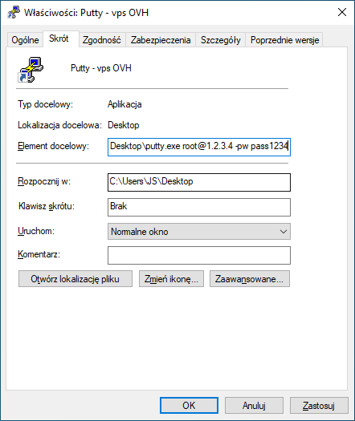

# 1. Logowanie użytkownikiem `root` przez SSH

Jeśli serwerownia nie przysłała hasła do `root`, 
tylko do `debian` lub `ubuntu`, 
to dobrze odblokować dostęp do konta `root` przez SSH.

Wiele osób odradza korzystanie z konta `root`.
Jednak początkujący - nie znający się na uprawnieniach plików w Linux -
mają więcej problemów z podstawowymi czynnościami na użytkowniku `ubuntu`/`debian`,
niż mogą narobić używając konta `root` do wszystkiego.

## 1.1 Edycja `/etc/ssh/sshd_config`

Po połączeniu przez SSH do serwera należy edytować plik `/etc/ssh/sshd_config`:
```
sudo pico /etc/ssh/sshd_config
```

### 1.1.1 Edycja `PermitRootLogin`

Kliknij `CTRL+W`, żeby włączyć wyszukiwanie i znajdź:
```
PermitRootLogin
```

Prawdopodobnie będzie to wyglądać tak:
```
#PermitRootLogin prohibit-password
```

Zmień to na:
```
PermitRootLogin yes
```

### 1.1.2 Edycja `PasswordAuthentication`

Kliknij `CTRL+W`, żeby włączyć wyszukiwanie i znajdź:
```
PasswordAuthentication
```

Jeśli będzie to wyglądać tak (np. w Oracle Cloud tak jest):
```
PasswordAuthentication no
```

Zmień to na:
```
PasswordAuthentication yes
```

### 1.1.3 Edycja czasu nieaktywności połączenia SSH

Przy okazji można zmienić wartości `ClientAliveInterval` i `ClientAliveCountMax` na:
```
ClientAliveInterval 20
ClientAliveCountMax 180
```
Dzięki temu SSH nie będzie zrywać połączenia co chwilę.

Kliknij `CRTL+O`, żeby zapisać zmiany i `CTRL+X`, żeby zakończyć edycję pliku.

### 1.1.4 Przeładowanie konfiguracji SSH

Zrestartuj `sshd`, aby przeładować konfigurację:
```
sudo systemctl restart sshd
```

## 1.2 Zmiana hasła `root`

Nie wiadomo, jakie jest hasło do użytkownika `root`, więc należy jakieś ustawić.
Wpisz:
```
sudo passwd
```
Pojawi się pytanie o nowe hasło, a potem o powtóre wpisanie.

Po zmianie hasła powinno dać się zalogować do serwera na konto `root`.

## 1.3 Odblokowanie logowania do konta `root` używając klucza SSH

Ten problem, jak na razie miałem tylko na serwerze z `Oracle Cloud`.

Próba dodania swojego klucza SSH do serwera - tego samego, który podało się tworząc maszynę i 
który używa się do logowania do konta `ubuntu`:
```
ssh-copy-id root@12.34.45.56
```
kończy się komunikatem:
```
Please login as the user "ubuntu" rather than the user "root".
```
i nie da się zalogować na konto `root` używając dodanego klucza.

Problemem jest to, że klucz SSH, który podaje się tworząc nowy serwer,
jest automatycznie przypisany do konta `root`.
Tzn. jest wklejany do pliku `/root/.ssh/authorized_keys`.

Tylko że w `/root/.ssh/authorized_keys` jest dopisana konfiguracja, 
która blokuje dostęp do `root` używając klucza.
Zawartość `/root/.ssh/authorized_keys` wygląda tak:
```
no-port-forwarding,no-agent-forwarding,no-X11-forwarding,command="echo 'Please login as the user \"ubuntu\" rather than the user \"root\".';echo;sleep 10;exit 142" ssh-rsa AAAAB3(...)ZDQSZP jskalski@jskalski
```
Usuń to, co jest przed `ssh-rsa`:
```
no-port-forwarding,no-agent-forwarding,no-X11-forwarding,command="echo 'Please login as the user \"ubuntu\" rather than the user \"root\".';echo;sleep 10;exit 142" 
```
Czyli po edycji powinno zostać coś jak:
```
ssh-rsa AAAAB3(...)ZDQSZP jskalski@jskalski
```

### 1.4 Skrót do Putty logujący do serwera

Jeśli nie używasz logowania kluczem SSH, tylko hasłem.
To prawdopodobnie w kółko kopiujesz hasło z jakiegoś pliku tekstowego.

Zamiast w kółko wpisywać hasło w Putty,
możesz utworzyć skrót do Putty w Windowsie i 
dopisać parametry z loginem, IP i hasłem:
```
putty.exe LOGIN@IP -pw HASŁO
```


