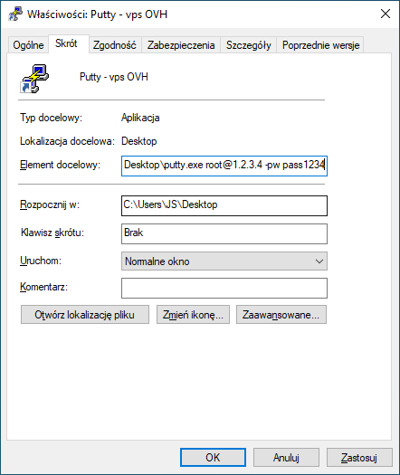

# 1. Logging in as `root` via SSH

If the data center didn't send the `root` password but instead sent one for `debian` or `ubuntu`, it's a good idea to unlock access to the `root` account via SSH.

Many people advise against using the `root` account. However, beginners who are not familiar with file permissions in Linux often encounter more issues with basic tasks on the `ubuntu`/`debian` user account than they might cause by using the `root` account for everything.

## 1.1 Editing `/etc/ssh/sshd_config`

After connecting to the server via SSH, edit the `/etc/ssh/sshd_config` file:
```
sudo pico /etc/ssh/sshd_config
```

### 1.1.1 Editing `PermitRootLogin`

Press `CTRL+W` to enable search and find:
```
PermitRootLogin
```

It will likely look like this:
```
#PermitRootLogin prohibit-password
```

Change it to:
```
PermitRootLogin yes
```

### 1.1.2 Editing `PasswordAuthentication`

Press `CTRL+W` to enable search and find:
```
PasswordAuthentication
```

If it looks like this (as it does in Oracle Cloud, for example):
```
PasswordAuthentication no
```

Change it to:
```
PasswordAuthentication yes
```

### 1.1.3 Editing SSH Inactivity Timeout

You can also change the `ClientAliveInterval` and `ClientAliveCountMax` values to:
```
ClientAliveInterval 20
ClientAliveCountMax 180
```
This will prevent SSH from frequently disconnecting.

Press `CTRL+O` to save the changes and `CTRL+X` to exit the file editor.

### 1.1.4 Reloading the SSH Configuration

Restart `sshd` to reload the configuration:
```
sudo systemctl restart sshd
```

## 1.2 Changing the `root` Password

If you don't know the password for the `root` user, you need to set one. Type:
```
sudo passwd
```
You will be prompted to enter a new password and then to confirm it.

After changing the password, you should be able to log in to the server as `root`.

## 1.3 Unlocking `root` Login Using SSH Key

This issue has only occurred for me on a server from `Oracle Cloud`.

When you try to add your SSH key to the server—the same key you provided when creating the machine and which you use to log in to the `ubuntu` account:
```
ssh-copy-id root@12.34.45.56
```
you get the message:
```
Please login as the user "ubuntu" rather than the user "root".
```
and you cannot log in to the `root` account using the added key.

The problem is that the SSH key provided when creating the new server is automatically assigned to the `root` account. It is inserted into the `/root/.ssh/authorized_keys` file.

However, the `/root/.ssh/authorized_keys` file includes a configuration that blocks access to `root` using the key. The contents of `/root/.ssh/authorized_keys` look like this:
```
no-port-forwarding,no-agent-forwarding,no-X11-forwarding,command="echo 'Please login as the user "ubuntu" rather than the user "root".';echo;sleep 10;exit 142" ssh-rsa AAAAB3(...)ZDQSZP jskalski@jskalski
```
Remove everything before `ssh-rsa`:
```
no-port-forwarding,no-agent-forwarding,no-X11-forwarding,command="echo 'Please login as the user "ubuntu" rather than the user "root".';echo;sleep 10;exit 142"
```
So after editing, it should look something like this:
```
ssh-rsa AAAAB3(...)ZDQSZP jskalski@jskalski
```

### 1.4 Putty Shortcut for Logging into the Server

If you are not using SSH key login but instead a password, you probably keep copying the password from a text file.

Instead of repeatedly entering the password in Putty, you can create a shortcut to Putty on Windows and add parameters for the login, IP, and password:
```
putty.exe LOGIN@IP -pw PASSWORD
```


